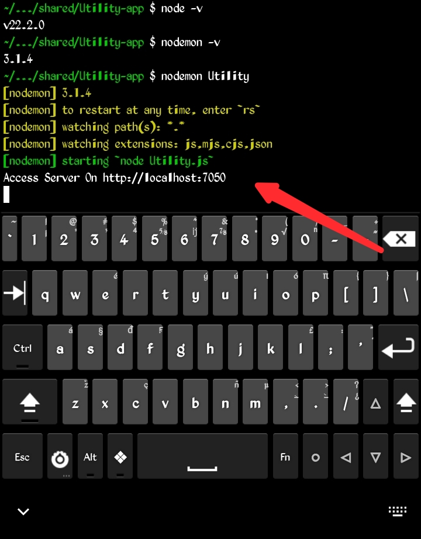
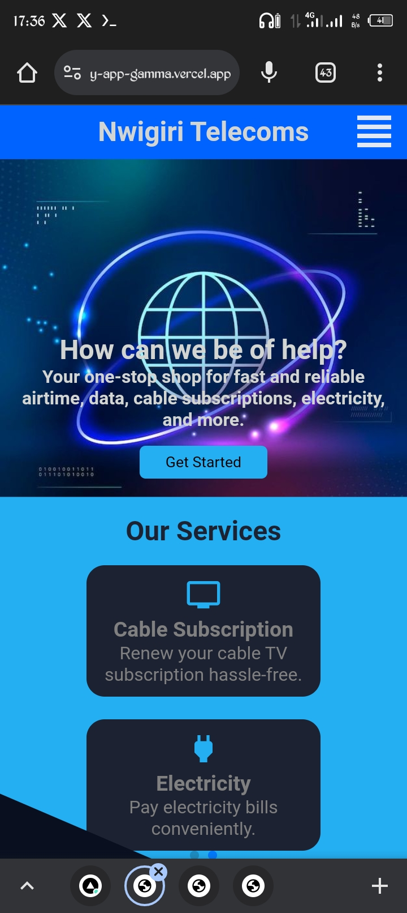

Utility App

This project is aimed to make data, airtime, cable and other utiility payment easy, less
cost and fast. this app would be made available in not just one country but multiple.

*Table Of Content*
    - Installation
    - Usage
    - Features
    - Contributing
    - License
    - Contact
    - Acknowledgment
    
*Installation*

First you need to make this repository available in your local machine. *Prerequisites* - nodejs(used v22.2.0 >), nodemon(used v3.1.4 >). if have both of this installed navigate to the repository root directory (Utility-app), run *npm install* (if you are using a desktop env), for anyone using termux on mobile run *npm install --no-bin-links*. after running this commands all the packages listed in the package.json would be installed. at this point you can run the app with *nodemon Utility*, you would get a response as shown in this image-

Utility.js is the app entry point, you don't need to tell nodemon what the file extension is hense *nodemon Utility*

*Acknowledgment*
Might come as a supprise to some great minded individuals who looked at a problem and developed a solution, as of the time of the creation of this README file I am not financially able to get a system but with the help of projects that some brilliant minds have developed I am able to code and learn a lot with a moblie device, special thanks to the creators of Termux Android Emulator, Android Code Editor, Acode. And special thanks to Julien @Alx Africa and all Alx team members.

*Ps*
This project was inspired by the thought of how difficult it is/was for newbies to purchase data for coding. The app is aimed to simplify and reduce the cost. The journey to becoming a tech nerd gets difficult as one makes progress, and without sheer will, it is nearly impossible to make it till the end...

*Authur*
Nwigiri Joshua

LinkedIn - https://www.linkedin.com/in/joshua7281
X - https://x.com/joshua3302